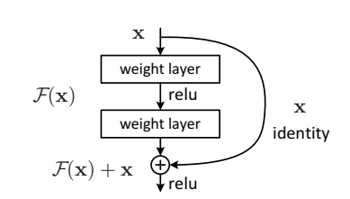
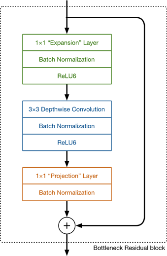
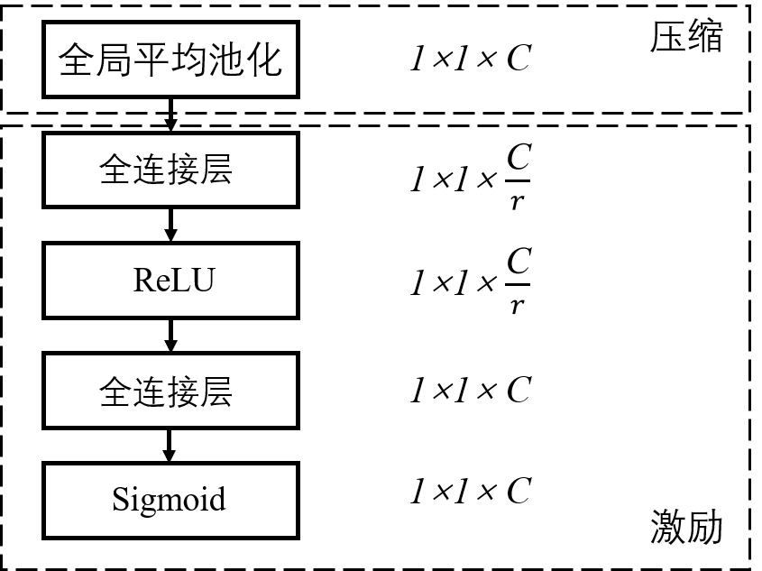

## 残差结构

残差网络在2015年，由**何凯明**等四位中国深度学习研究者在论文《**Deep Residual Learning for Image Recognition**》提出，极大地提高了卷积神经网络在**图像领域的精度**。残差网络中反复使用到了**残差结构**，这种结构在之后的**新型网络中被反复使用**。

为什么会提出这种结构？原因在于，更加**深层的卷积网络**往往更能提取出图像的特征，而且拟合能力更强，这样的深层网络给训练带来了很大的困难。**网络层数越深，SGD优化梯度变得更困难**，很容易出现**梯度为0或者梯度爆炸**的情况。残差网络很好地解决了这个问题。

残差结构的通用形式如上图，输入**X分成两路**，一路不经过任何的操作(**shortcut**)，另外一路经过相应的权重层和激活函数(**residual**)，最后将这两路**直接相加**，再经过一个激活函数输出结果。

可以看到残差结构有一个明显的特征就是有**一条捷径什么都不做，直接和另一路相加**。相当于将原始图像和处理后图像进行了**特征融合**，而且**解决了难以训练的问题**。这个简单的加法并不会给网络增加**额外的参数和计算量**，却可以大大增加模型的训练速度、提高训练效果。

作者提出了两种具体的实现方式：

左图对应输入通道为64时，用两个(3,3)的卷积，中间不改变通道数，最后**相加激活**得到输出。右图对应于输入通道为256时，先用一个(1,1)的卷积把**通道数缩小为1/4**，然后在这个通道数上进行(3,3)的卷积，最后再经过一个(1,1)的卷积改为原通道，然后**相加激活**的到输出。

**ResNet34中使用的是左图的残差结构，ResNet50/101/152使用的是右图的残差结构。**

## **深度可分离卷积**

深度可分离卷积也是一个非常常用的卷积结构，特别是在**轻量化的卷积网络**中应用广泛。它的结构如下图：

对于一个输入矩阵，我先用一个(3,3)的卷积，各个通道**不相加**，这个过程其实就是**分组卷积**，**分组的个数等于输入通道数**，之后再用(1,1)的卷积改变**输出通道数**。

可以明显地看出，深度可分离卷积**极大地降低了卷积的参数量**，这一大有点也就意味着这种卷积结构**非常适合应用于轻量化的网络**中。例如**Google团队**开发的**MobileNet**网络。其中就用到了很多这样的结构。

**MobileNetV2**中先用(1,1)的卷积改变通道数，对于这个输出用**深度可分离卷积**，最后也使用了**残差结构**，有一个相加的部分。和原始残差结构不同的是，原始残差结构**中间通道数最小，两头大**，**MobileNet**中**中间通道数大，两头小**。这种结构也叫做**反残差**。

## 注意力机制

**注意力机制**是当前研究的热点问题，这里我们介绍最简单的**SE注意力机制**。SE注意力机制把目光放在了**通道之间的关系上**，之前所有的所有运算，**对于所有通道数都是一视同仁的**。**SE注意力机制**希望模型可以**自动学习到不同channel特征的重要程度**，因为很显然各个通道间**所包含特征的重要程度是不一样的**。它的结构如下：

通过一个**全局平局池化层**，将**输入大小压缩成1**，通道数不变，我们对这个1维的矩阵做**激励**，这样得到一个一维的矩阵，相当于是**各个通道的权重**，将这个激励和原输入**相乘**，就得到了一个**通道重要程度不同的输出**。这样就区分出了各个通道的重要性。

原始SE注意力机制的**压缩**和**激励**如下：

激励部分使用**两个全连接层**，使用的激活函数为**rule**和**sigmoid**，之后和输入**相乘**即可。

**ResNet**和**MobileNet**使用**注意力机制**之后，精度都得到了相应的提升。

**ResNet**中的**SE注意力机制**放在了(1,1)卷积之后，激励部分使用的是**全连接层**。MobileNetV3中**SE注意力机制**放在了(1,1)卷积之前，并且激励部分使用的是**卷积层**。

## 参考资料

https://arxiv.org/abs/1512.03385

https://arxiv.org/abs/1905.02244

https://arxiv.org/abs/1709.01507

https://blog.csdn.net/qq_42617455/article/details/108165206

https://machinethink.net/blog/mobilenet-v2/

https://mp.weixin.qq.com/s?__biz=MzA5ODEzMjIyMA==&mid=2247496109&idx=1&sn=a7a6558b086266c062925600e3e71394&source=41#wechat_redirect
