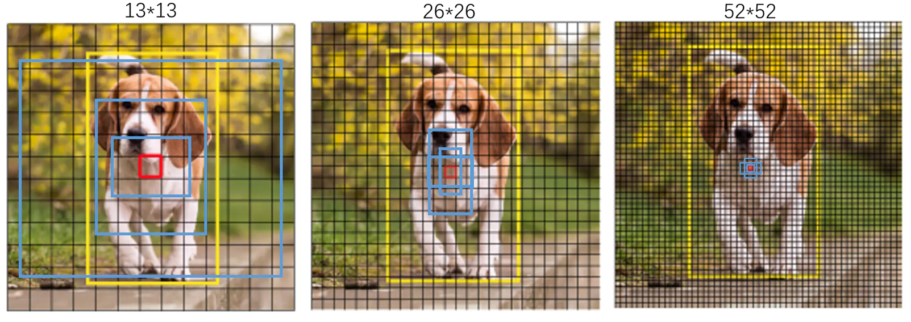
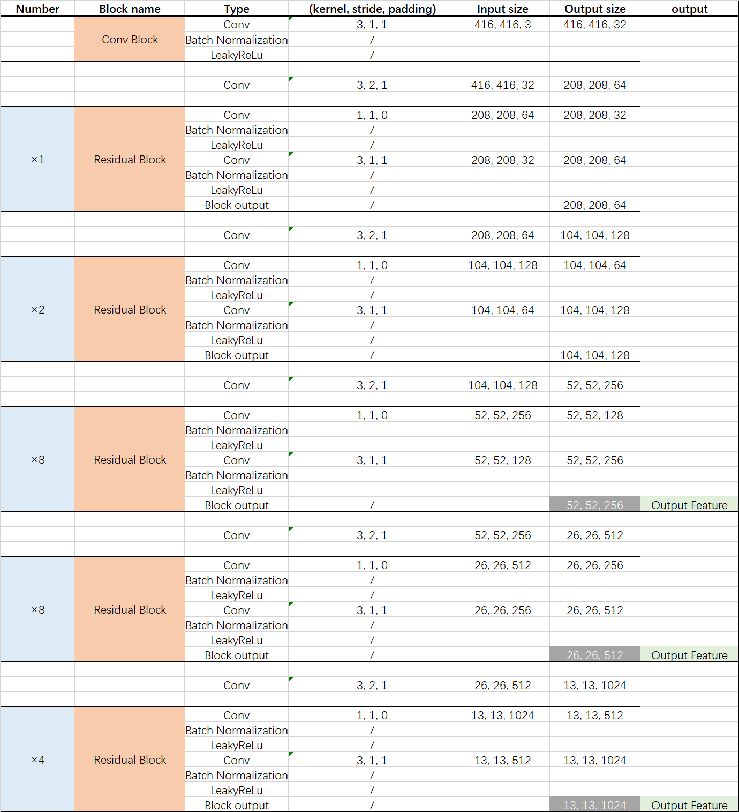

## YOLOv3介绍

**YOLOv3**是**2018年**提出的目标检测算法，取得了非常优秀的效果。直至今天，**YOLO**系列仍是当前目标检测的**主流算法**，诞生了一系列的变体，如**YOLOv4**，**YOLOv5**，**YOLOX**等。新的算法大多都是对**YOLOv3**算法的**小修改**，本质上没有非常大的改变

作为目标检测算法，相比分类算法要复杂一些，**除了需要输出类别以外，还需要对特征物体进行定位**。下面我们一起看一下**YOLOv3**的**具体实现流程**。

<div align="center">

</div>

**YOLOv3**是**anchor based**算法，也就说预先在图片上生成很多的**先验框**，然后我通过神经网络去判断放的**框内有没有我想要的特征物体，如果有特征物体，就对先验框的中心和长和宽进行调整，最终框出物体的长和宽**。

**YOLOv3**的网络有**三个输出**，对于输入为(3,416,416)的图片，通过这个网络之后会输出(75,13,13)，(75,26,26)，(75,52,52)，分别对应了上面的三张图片，把图像分成了**多个网格**，每个网格上都会放置好**3个先验框**，先验框的**长宽是一开始就固定的**，**13×13的网格用于检测大物体，26×26的网格用于检测中等物体，52×52的网格用于检测小物体**。一共有**13×13×3+26×26×3+52×52×3**个框。**物体中心点落在哪个框内，这个框就负责识别这个物体。**

**75的含义是3×(num_class+4+1)**，这是对应**voc**数据集，有**20**个类别。**20指的是20个类别的概率**，**4指对先验框的中心点和长宽的修正量，1指这个框内有没有物体。**因为每个格子都有**3个先验框**，所以再乘3。如果使用**coco数据集**，有80个类别，那么对应的维度就是**3×(80+4+1)=255**。

## YOLOv3整体网络

<div align="center">

</div>

**YOLOv3**整体网络结构分为了**三大部分**，分别为**backbone**,**neck**和**head**。它的维度变换如下：

<div align="center">

</div>

## DarkNet53

**YOLOv3**使用的**backbone**部分为**DarkNet53**，这一部分也成为**特征提取网络**，和我们**分类的网络是基本一致的，这部分是通用的**。也就是说，我们之前讲解过的**Mobilenetv3**也可以放在**YOLOv3**的**backbone**，来实现**检测任务**。

**DarkNet53**借助于**残差结构**，是一个比较**深层**的网络，一共有**53**层网络。总体的形式如下：

<div align="center">

</div>

通过学习**Mobilenetv3**，相比大家学习新的网络就轻松很多了。**DarkNet53**从图上看，就是**Residual Block的多次使用**，我们只要清楚了**Residual Block**的结构，整个**DarkNet53**就非常清晰了。

Residual Block是由**两个卷积归一化层**组成，先用一个**1×1**的卷积层，把通道数**降低为一半**，再用一个**3×3**的卷积层提取特征，最后再将**输入和输出相加得到最后的输出**。**DarkNet53**分别使用了[1,2,8,8,4]次**Residual Block**，最后三次的block分别输出了**三个特征图**，shape分别为（52，52，256），（26，26，512），（13，13，1024），再将这个三个输出输入的**neck**部分中。

和分类网络相比，无非是**少了尾部的结构**，换句话说加上尾部结构，**DarkNet53**也可以用于**分类任务**，当然**Mobilenetv3去掉尾部结构，也可以适用于检测任务。**

## Paddle代码实现

```
import paddle
import paddle.nn as nn
import paddle.nn.functional as F
from paddle import ParamAttr
from paddle.regularizer import L2Decay

def batch_norm(ch,
               norm_type='bn',
               norm_decay=0.,
               freeze_norm=False,
               initializer=None,
               data_format='NCHW'):
    if norm_type == 'sync_bn':
        batch_norm = nn.SyncBatchNorm
    else:
        batch_norm = nn.BatchNorm2D

    norm_lr = 0. if freeze_norm else 1.
    weight_attr = ParamAttr(
        initializer=initializer,
        learning_rate=norm_lr,
        regularizer=L2Decay(norm_decay),
        trainable=False if freeze_norm else True)
    bias_attr = ParamAttr(
        learning_rate=norm_lr,
        regularizer=L2Decay(norm_decay),
        trainable=False if freeze_norm else True)

    norm_layer = batch_norm(
        ch,
        weight_attr=weight_attr,
        bias_attr=bias_attr,
        data_format=data_format)

    norm_params = norm_layer.parameters()
    if freeze_norm:
        for param in norm_params:
            param.stop_gradient = True

    return norm_layer


class ConvBNLayer(nn.Layer):
    def __init__(self,
                 ch_in,
                 ch_out,
                 filter_size=3,
                 stride=1,
                 groups=1,
                 padding=0,
                 norm_type='bn',
                 norm_decay=0.,
                 act="leaky",
                 freeze_norm=False,
                 data_format='NCHW',
                 name=''):

        super(ConvBNLayer, self).__init__()

        self.conv = nn.Conv2D(
            in_channels=ch_in,
            out_channels=ch_out,
            kernel_size=filter_size,
            stride=stride,
            padding=padding,
            groups=groups,
            data_format=data_format,
            bias_attr=False)
        self.batch_norm = batch_norm(
            ch_out,
            norm_type=norm_type,
            norm_decay=norm_decay,
            freeze_norm=freeze_norm,
            data_format=data_format)
        self.act = act

    def forward(self, inputs):
        out = self.conv(inputs)
        out = self.batch_norm(out)
        if self.act == 'leaky':
            out = F.leaky_relu(out, 0.1)
        return out


class DownSample(nn.Layer):
    def __init__(self,
                 ch_in,
                 ch_out,
                 filter_size=3,
                 stride=2,
                 padding=1,
                 norm_type='bn',
                 norm_decay=0.,
                 freeze_norm=False,
                 data_format='NCHW'):

        super(DownSample, self).__init__()

        self.conv_bn_layer = ConvBNLayer(
            ch_in=ch_in,
            ch_out=ch_out,
            filter_size=filter_size,
            stride=stride,
            padding=padding,
            norm_type=norm_type,
            norm_decay=norm_decay,
            freeze_norm=freeze_norm,
            data_format=data_format)
        self.ch_out = ch_out

    def forward(self, inputs):
        out = self.conv_bn_layer(inputs)
        return out


class BasicBlock(nn.Layer):
    def __init__(self,
                 ch_in,
                 ch_out,
                 norm_type='bn',
                 norm_decay=0.,
                 freeze_norm=False,
                 data_format='NCHW'):

        super(BasicBlock, self).__init__()

        self.conv1 = ConvBNLayer(
            ch_in=ch_in,
            ch_out=ch_out,
            filter_size=1,
            stride=1,
            padding=0,
            norm_type=norm_type,
            norm_decay=norm_decay,
            freeze_norm=freeze_norm,
            data_format=data_format)
        self.conv2 = ConvBNLayer(
            ch_in=ch_out,
            ch_out=ch_out * 2,
            filter_size=3,
            stride=1,
            padding=1,
            norm_type=norm_type,
            norm_decay=norm_decay,
            freeze_norm=freeze_norm,
            data_format=data_format)

    def forward(self, inputs):
        conv1 = self.conv1(inputs)
        conv2 = self.conv2(conv1)
        out = paddle.add(x=inputs, y=conv2)
        return out


class Blocks(nn.Layer):
    def __init__(self,
                 ch_in,
                 ch_out,
                 count,
                 norm_type='bn',
                 norm_decay=0.,
                 freeze_norm=False,
                 name=None,
                 data_format='NCHW'):

        super(Blocks, self).__init__()

        self.basicblock0 = BasicBlock(
            ch_in,
            ch_out,
            norm_type=norm_type,
            norm_decay=norm_decay,
            freeze_norm=freeze_norm,
            data_format=data_format)
        self.res_out_list = []
        for i in range(1, count):
            block_name = '{}.{}'.format(name, i)
            res_out = self.add_sublayer(
                block_name,
                BasicBlock(
                    ch_out * 2,
                    ch_out,
                    norm_type=norm_type,
                    norm_decay=norm_decay,
                    freeze_norm=freeze_norm,
                    data_format=data_format))
            self.res_out_list.append(res_out)
        self.ch_out = ch_out

    def forward(self, inputs):
        y = self.basicblock0(inputs)
        for basic_block_i in self.res_out_list:
            y = basic_block_i(y)
        return y


DarkNet_cfg = {53: ([1, 2, 8, 8, 4])}

class DarkNet(nn.Layer):
    __shared__ = ['norm_type', 'data_format']

    def __init__(self,
                 depth=53,
                 freeze_at=-1,
                 return_idx=[2, 3, 4],
                 num_stages=5,
                 norm_type='bn',
                 norm_decay=0.,
                 freeze_norm=False,
                 data_format='NCHW'):

        super(DarkNet, self).__init__()
        self.depth = depth
        self.freeze_at = freeze_at
        self.return_idx = return_idx
        self.num_stages = num_stages
        self.stages = DarkNet_cfg[self.depth][0:num_stages]

        self.conv0 = ConvBNLayer(
            ch_in=3,
            ch_out=32,
            filter_size=3,
            stride=1,
            padding=1,
            norm_type=norm_type,
            norm_decay=norm_decay,
            freeze_norm=freeze_norm,
            data_format=data_format)

        self.downsample0 = DownSample(
            ch_in=32,
            ch_out=32 * 2,
            norm_type=norm_type,
            norm_decay=norm_decay,
            freeze_norm=freeze_norm,
            data_format=data_format)

        self._out_channels = []
        self.darknet_conv_block_list = []
        self.downsample_list = []
        ch_in = [64, 128, 256, 512, 1024]
        for i, stage in enumerate(self.stages):
            name = 'stage.{}'.format(i)
            conv_block = self.add_sublayer(
                name,
                Blocks(
                    int(ch_in[i]),
                    32 * (2**i),
                    stage,
                    norm_type=norm_type,
                    norm_decay=norm_decay,
                    freeze_norm=freeze_norm,
                    data_format=data_format,
                    name=name))
            self.darknet_conv_block_list.append(conv_block)
            if i in return_idx:
                self._out_channels.append(64 * (2**i))
        for i in range(num_stages - 1):
            down_name = 'stage.{}.downsample'.format(i)
            downsample = self.add_sublayer(
                down_name,
                DownSample(
                    ch_in=32 * (2**(i + 1)),
                    ch_out=32 * (2**(i + 2)),
                    norm_type=norm_type,
                    norm_decay=norm_decay,
                    freeze_norm=freeze_norm,
                    data_format=data_format))
            self.downsample_list.append(downsample)

    def forward(self, inputs):
        x = inputs

        out = self.conv0(x)
        out = self.downsample0(out)
        blocks = []
        for i, conv_block_i in enumerate(self.darknet_conv_block_list):
            out = conv_block_i(out)
            if i == self.freeze_at:
                out.stop_gradient = True
            if i in self.return_idx:
                blocks.append(out)
            if i < self.num_stages - 1:
                out = self.downsample_list[i](out)
        return blocks

model = DarkNet()
output = model(paddle.rand((1,3,416,416)))
for out in output:
    print(out.shape)
    
```

## 参考资料

https://blog.csdn.net/weixin_44791964/article/details/105310627

https://blog.csdn.net/qq_40210586/article/details/106144197
