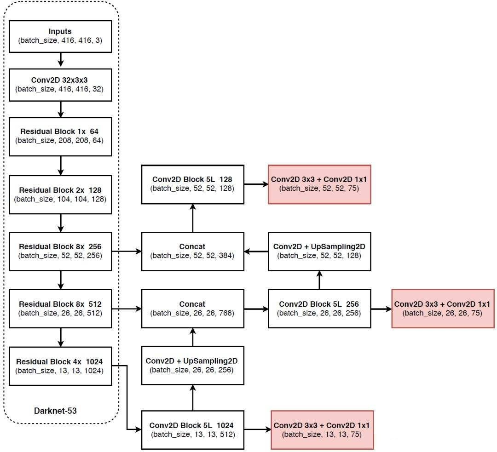
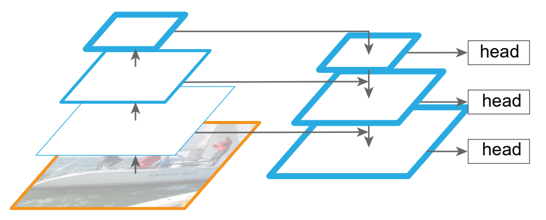
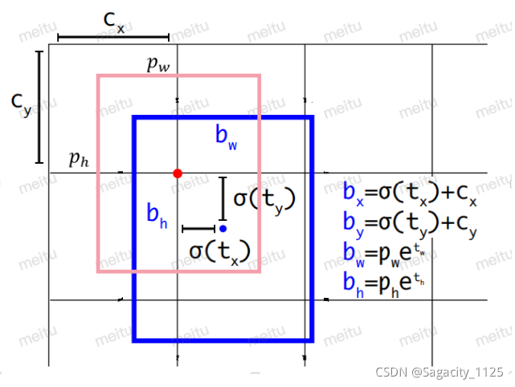

## YOLOv3整体结构

## Neck

### 整体结构

**YOLOv3**的**neck**部分使用的是**FPN**，这一部分也叫**特征金字塔**，它的作用是将**多尺度的出入进行特征融合**。

**backbone**部分输出的shape分别为（13，13，1024），（26，26，512），（52，52，256）。将这三个输出分别输入到FPN中，我们先看（13，13，1024）这一个输入，**经过5次卷积后**，输出（13，13，512），然后**兵分两路**，一路传入到**head**中，一路再经过**一个卷积和上采样**，得到（26，26，256），将这个输出和**backbone**的第2个输出也就是（26，26，512）**堆叠**（**concat**）,得到（26，26，768）。

卷积池化使得图像**大小越来越小**，这个过程叫**下采样**。**上采样就是通过插值的方法，扩充图像大小**，就像这边的（13，13）变成（26，26）。

**concat**操作是把两个矩阵**堆叠**到一起，里面的数不变，只是单纯的堆叠，**shape等于两个相加**。这一点希望大家和残差结构中的**add**区分开，相加操作需要**两个输入shape一致，里面的数也会相加**。

后续部分其实就是第一种操作的重复。堆叠后的矩阵，经过5次卷积，再兵分两路，一路输入head，一路经过卷积上采样，和backbone第一个输出堆叠。最后通过五次卷积，输入到head中。

### 主要特点

**FPN有3个输入，3个输出**，输入shape分别为（13，13，1024），（26，26，512），（52，52，256），输出shape分别为（13，13，512），（26，26，256），（52，52，128）。

很清晰地可以看出，**FPN只有深层向浅层的融合，并没有浅层向深层的融合**。后续诞生的**PAN**结构，除了有深层向浅层的融合，还有浅层向深层的融合，是FPN的一个升级版，有兴趣的同学可以自己学习。

## Head

**Head**部分非常简单，包含一个**3×3的卷积层和1×1的卷积层**。3×3的卷积层将**通道数扩充一倍**，1×1的卷积层做最后的调整，也就是把通道数缩小到3×(num_class+4+1)。

这样通过**backbone**，**neck**，**head**三部分，完成了从原始图像（416，416，3）到（13，13，75），（26，26，75），（52，52，75）的转化。

## 解码过程

获得到网络输出的三个矩阵后，并不是**直接获得了我们最后的预测框**。我们之前说过对于voc数据集，75=3×（20+4+1），其中20和1都是和分类相关的，我们这边**重点看一下这个4**，也就是**对先验框的4个调整的参数**，通过调整后也就输出了最后的预测框。

先验框是**固定不变的**，每个特征图，每个图的**每个格子有3个先验框**，所以我们需要预先准备**9个大小的先验框**。

anchors大小：[116,90],[156,198],[373,326],[30,61],[62,45],[59,119],[10,13],[16,30],[33,23]，这些大小是**相对于416×416的尺寸**，我们最后三个输出的大小为13×13，26×26，52×52，所以要进行**相应的缩放**。

我们以13×13的输出为例，原本416×416大小变成13×13，相当于缩小了**32倍**，也就是说**原图32×32个小方块对应于最后输出的1×1的像素点**。anchors[116,90],[156,198],[373,326]相应地长宽都应该**除以32**，这就是**13×13每个点上的三个先验框**。

**粉红色**的就是对应到13×13上的**先验框**，它是我们一开始自己就确定的，显然是**不正确**，需要模型对它调整。

先验框怎么摆放的呢，它的中心就是落在**13×13的交点**上，长宽就是除以32的结果。先验框坐标记为**（cx,cy,pw,ph）**，模型输出的4为**（tx,ty,tw,th）**,调整的公式如上图所示，中心点取**sigmoid激活函数**，**sigmoid函数范围是0-1**，也就是中心点的调整范围永远在**右下角的框内**，这也就是我们说的，**物体的中心落在哪个格子里，就有哪个框负责预测**。

**长宽取exp后相乘**。这就得到了在13×13尺寸图上的预测框，然后**再乘以32缩放回来就得到了最后的预测框**。

## YOLOv3的改进方法

YOLOv3仍有很多改进的**tricks**，如更换新型的**backbone**，原始的darknet53参数量较大，对于一些终端设备难以适配；增加一些**注意力机制**；使用**新型的数据增强方法**等。当然也可以**调整输出**，或者是**调整每个格子上先验框的个数**。

## 参考资料

https://blog.csdn.net/weixin_44791964/article/details/105310627

https://blog.csdn.net/Sagacity_1125/article/details/120550505?utm_medium=distribute.pc_aggpage_search_result.none-task-blog-2~aggregatepage~first_rank_ecpm_v1~rank_v31_ecpm-1-120550505.pc_agg_new_rank&utm_term=yolov3+%E8%A7%A3%E7%A0%81&spm=1000.2123.3001.4430
