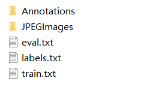
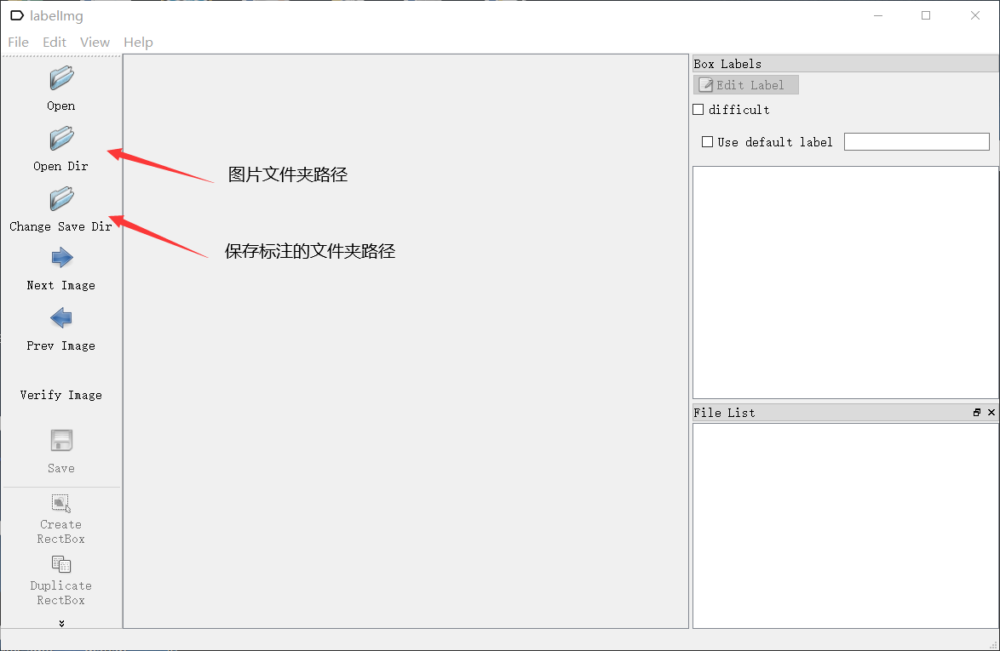
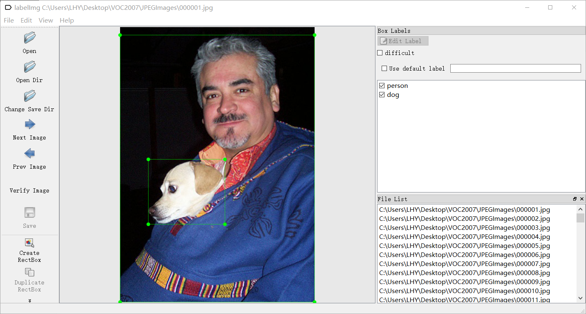

## 数据集

### 数据集结构

在实际项目中最常用的是voc数据集格式，我们以voc数据集为例，进行介绍。

<div align="center">

</div>

JPEGImages存放所有数据集图片，Annotations中存放所有标注文件。

如图片000001.jpg，它对应的标注就是000001.xml

<div align="center">

</div>

这张图片对应的标注信息如下：

```
<annotation>
	<folder>VOC2007</folder>
	<filename>000001.jpg</filename>
	<source>
		<database>The VOC2007 Database</database>
		<annotation>PASCAL VOC2007</annotation>
		<image>flickr</image>
		<flickrid>341012865</flickrid>
	</source>
	<owner>
		<flickrid>Fried Camels</flickrid>
		<name>Jinky the Fruit Bat</name>
	</owner>
	<size>
		<width>353</width>
		<height>500</height>
		<depth>3</depth>
	</size>
	<segmented>0</segmented>
	<object>
		<name>dog</name>
		<pose>Left</pose>
		<truncated>1</truncated>
		<difficult>0</difficult>
		<bndbox>
			<xmin>48</xmin>
			<ymin>240</ymin>
			<xmax>195</xmax>
			<ymax>371</ymax>
		</bndbox>
	</object>
	<object>
		<name>person</name>
		<pose>Left</pose>
		<truncated>1</truncated>
		<difficult>0</difficult>
		<bndbox>
			<xmin>8</xmin>
			<ymin>12</ymin>
			<xmax>352</xmax>
			<ymax>498</ymax>
		</bndbox>
	</object>
</annotation>
```

### 制作数据集

使用labelImg软件制作目标检测数据集。

<div align="center">

</div>

键盘A和D代表上一张和下一张，W为标注工具，标注完成后CTRL+S保存，这样一张图片就标注完成了。所有的图片都需要进行标注，而且不能遗漏目标物体，这一过程是非常耗时耗力的。

<div align="center">

</div>

## PaddleDetection

把制作好的数据集放在dataset文件夹下，然后修改configs里面的标注文件，对应你想要修改的模型，特别需要注意修改dataset相关的参数，如果对模型不做特别修改，其他大多数参数都不需要改变。

### 模型训练

```
python tools/train.py -c configs/yolov3/yolov3_darknet53_270e_voc.yml --use_vdl=True --eval
```

### 断点训练

```
python tools/train.py -c configs/yolov3/yolov3_darknet53_270e_voc.yml -r output/yolov3_darknet53_270e_voc/100
```

### 模型评估

```
python tools/eval.py -c configs/yolov3/yolov3_darknet53_270e_voc.yml -o weights=output/yolov3_darknet53_270e_voc/best_model
```

### 模型导出

```
python tools/export_model.py -c configs/yolov3/yolov3_darknet53_270e_voc.yml --output_dir=./inference_model -o weights=output/yolov3_darknet53_270e_voc/best_model
```

### 模型预测

```
python deploy/python/infer.py --model_dir=./inference_model/yolov3_darknet53_270e_voc --image_file=./street.jpg --device=GPU --threshold=0.2
```

