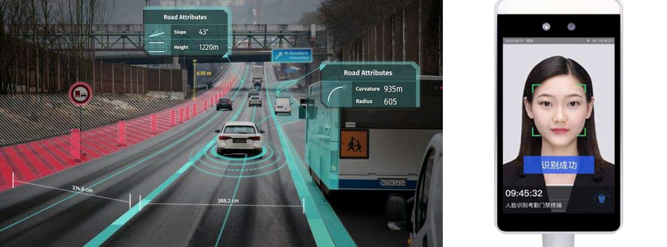
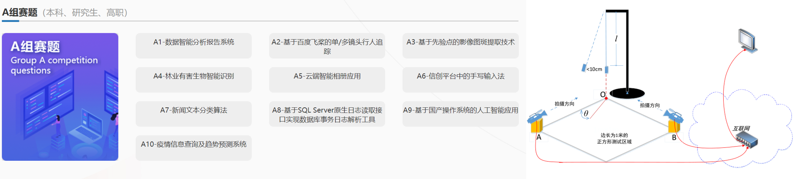
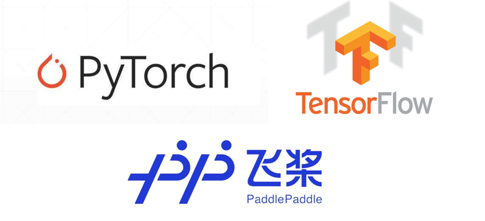

### 学习人工智能的意义

近些年来，人工智能技术迅速发展，已经在多个领域取得了实质性的突破，也有了众多工业内的应用，新能源汽车的**自动驾驶**、路面交通的**违章识别**、每日打卡的**人脸识别**、大数据的**智能化搜索**以及**文字的提取翻译**等等，都使用了人工智能技术。其中，计算机视觉是人工智能的重要组成部分，以往使用传统技术很难攻克的难题，都被人工智能技术一一化解，可以说人工智能推动了整个计算机视觉领域的发展，是一种非常强大的技术手段。

这么强大的技术，我们学习它究竟有什么意义呢？

1. 结合我自身的切身感受来说，在本科阶段，我自己也参加了很多的学生实验室和科创比赛，越来越多的比赛会涉及到计算机视觉的技术。对于综合类比赛，例如**挑战杯**、**创青春**、**互联网+**等，很多的参赛队伍都使用到了人工智能，作为一大创新点，在比赛中脱颖而出；对于专业类比赛，例如**软件杯**、**robcup**，甚至是今年的**电子设计竞赛**等等，也涉及了很多计算机视觉方面的要求，比如说识别一些特征物体，识别一些数字，或者垃圾分类，这些硬性的题目要求，如果对于计算机视觉不是很了解，那做起来就会非常困难。
2. 对于发表论文的研究生学长学姐，可以看到现在很多的**交叉学科**，都在将**计算机视觉和相关专业进行融合**，借助视觉这种新的技术手段，对专业内的一些问题提出新的解决方法和思路，举个简单的例子，就我们电气专业来说，可以使用计算机视觉的方法监视绝缘子老化的情况，以往呢可能需要使用一些传感器或者是其他的手段。

### 开发平台

目前，人工智能的开发平台有很多，国外的平台有**torch**、**tensorflow**、**keras**等，国内平台有百度的**paddle**等，每个开发平台都有各自的特点。本期教程是以百度的**paddle**平台为例，版本为2.0以上的动态图版本，和**pytorch**的用法是非常相似的，学完本期的教程，也基本学完了**pytorch**的用法。

现在已经有了很多非常优秀的深度学习教程，本期教程是以**实际应用**为主，对于原理部分也会做一些简单的介绍，更多地是为了**解决问题，实现相应的功能**，能够让同学们快速地**入门深度学习**，也是我自己对本科阶段学习计算机视觉的回顾和总结。

教程里不包括**python**基础语法的讲解，也不包括**numpy**，**opencv**这些基础视觉工具库的讲解，需要同学们自己预先的学习，希望这门教程对大家有所帮助和启发。

