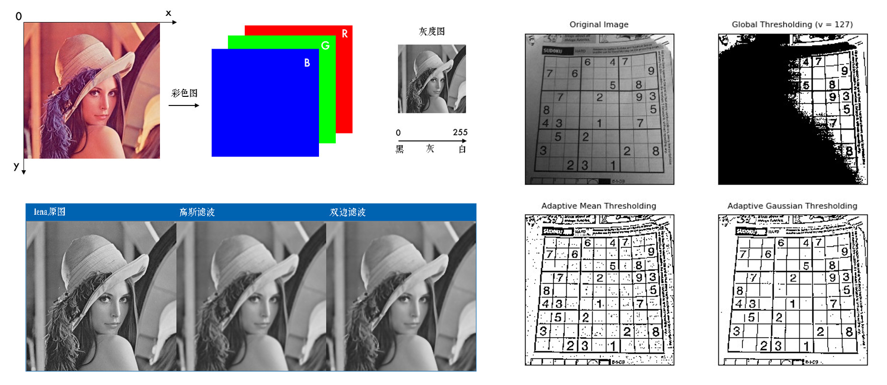
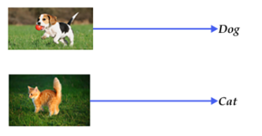
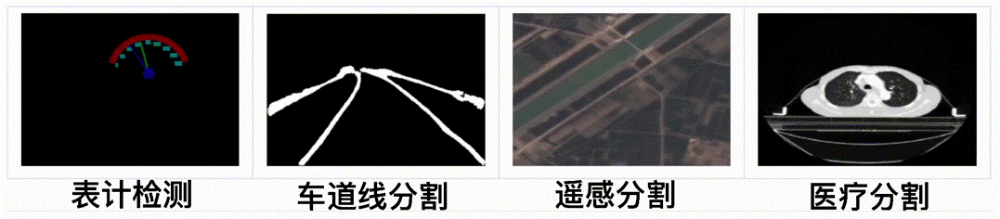

## 传统计算机视觉方法

传统的计算机视觉可以使用**Opencv**等Python库，对图像进行简单的操作，例如对图像**缩放**、**滤波**、**阈值分割**等等。对于计算机来说，一张彩色图片就是一个**三通道的矩阵**，分别对应**红绿蓝（RGB）**三种颜色，通过改变颜色的数值（**0-255**）来显示出一张完整的彩色图片，传统的计算机视觉就是围绕这一个三维矩阵，比如设置一个颜色区间，进行过滤等等操作。

这一类视觉处理的方法，功能相对较弱一些，能够处理一些简单的应用场景，比如**识别绿色物体**，**识别动态的物体**等。但是对于**背景复杂的实际场景中，很多问题都难以解决**。

推荐Opencv教程地址：https://github.com/CodecWang/opencv-python-tutorial

## 深度学习

通过人工智能对图像进行处理的算法有很多，其中最为经典的为**卷积神经网络**，对原始图像不停**卷积运算**，**充分提取特征**，最后输出想要的结果，这类方法经过实践的验证取得了**非常不错的精度表现**，在目前的很多硬件上，都能够跑出**实时**的效果。

当然，更多新型的视觉处理算法也涌现出来，比如最近比较火热的**Transformer**算法，最初应用于**NLP**（**自然语言处理**），最近科研者们发现它在视觉领域也展现出了非常不错的表现，很多领域下都取得了最佳的精度，**突破了卷积神经网络的精度瓶颈**。我们这期教程还是围绕卷积神经网络，这种经典的算法展开，仍然值得大家深入地学习。

## 计算机视觉任务的分类

### 分类（Classification）

分类任务是对整张图片进行分类，例如最为经典的**猫狗分类**。

猫狗分类就是让计算机对于我指定的图片进行归类，如果这张图片是猫，我把图片输入到模型后，我期望输出的就是猫这个类别。可以看到，分类任务是对**整张图片的归类**，如果一张图片里面既有猫，又有狗，那么显然分类无法完成，因为分类任务是**不需要对物体定位**的。分类任务是计算机视觉最简单的任务，实现的**难度最低**，当然**功能也最为简单**。

### 检测（Detection）

检测任务相对于分类任务，需要精确地对图像中的**目标物体定位**，一般用**矩形框确定目标位置**。如上图，一张图片中，有狗，有自行车，有汽车，对于检测任务，就需要精确地**框出他们的位置**，**并判别类别**。检测任务是对图像中的物体进行特征识别，相比分类任务难度有所提升，也是我们经常会有的需求，需要精确判定特征物体在画面中的位置，例如**行人检测**，**人脸检测**等等。

### 分割（Segmentation）

分割任务的难度再次增加，任务要求不仅需要确定位置，还需要**勾勒出物体的轮廓**，类似**PS的抠图**，过滤去背景。例如上图所示的**工业读表**，**车道线分割**等等，这类任务对于模型和算法的考验较大，在特定的场合中有一定的应用。

