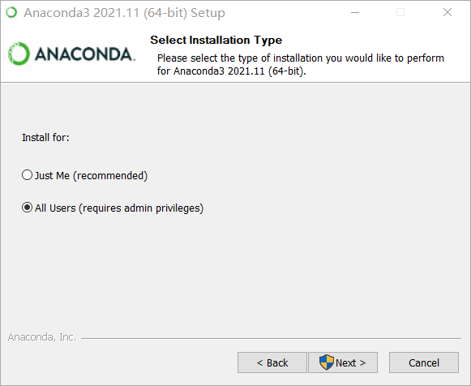
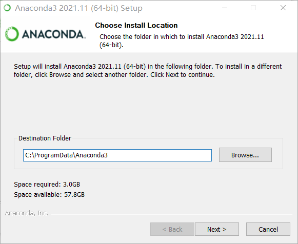
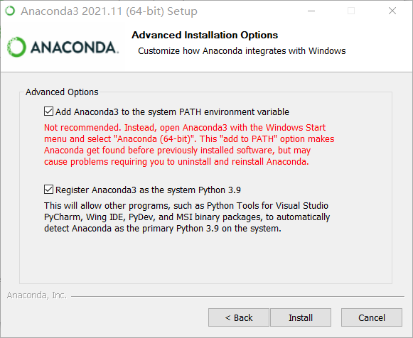
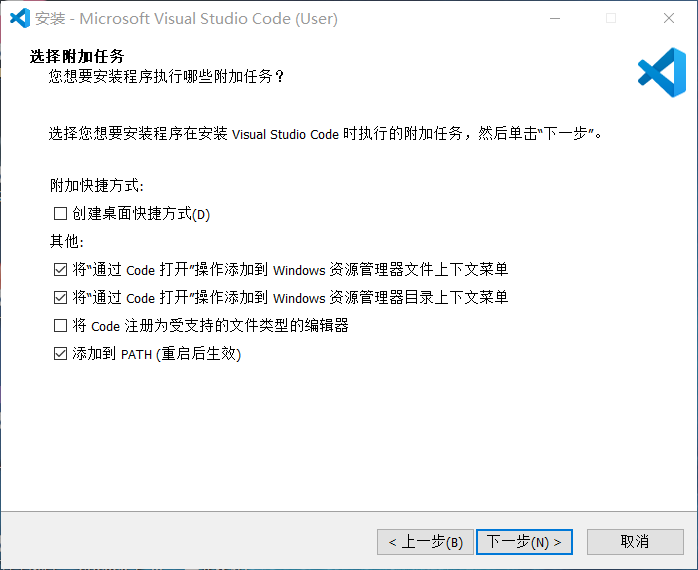
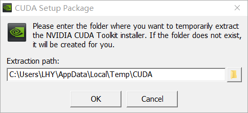
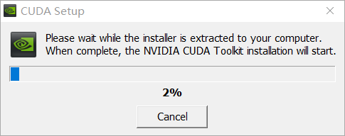
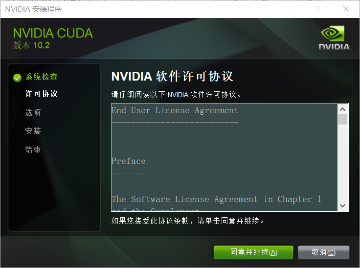
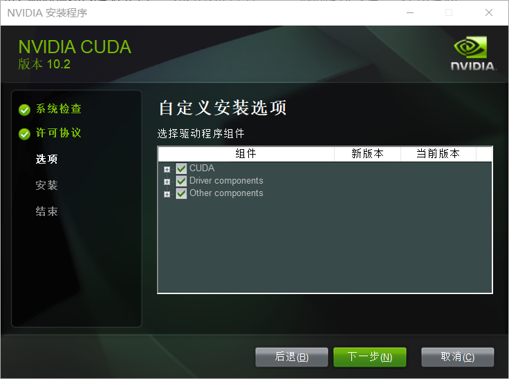
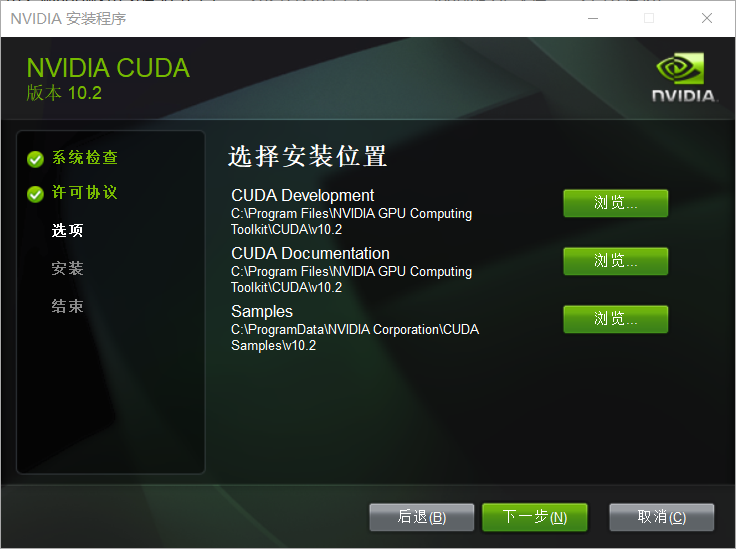
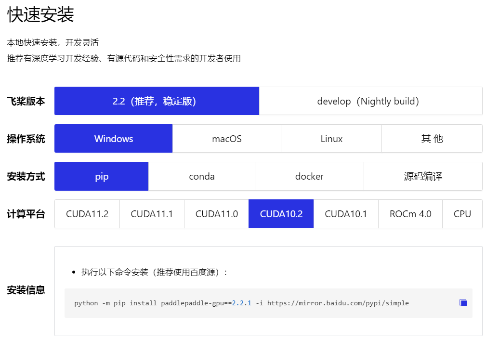

## 安装Anaconda

软件下载链接：

```
https://pan.baidu.com/s/1SqEpDgNycHs7ZHbNfZlv7A 
提取码：mclu
```

双击打开anaconda软件安装包：

<div align="center">

</div>

点击Next，下一步

<div align="center">

</div>

点击I Agree

<div align="center">

</div>

勾选**All Users**

<div align="center">

</div>

这里选择安装位置，可以自己新建文件夹，安装到**C盘以外的磁盘**。

<div align="center">

</div>

这里**建议勾选第一个选项**，将anaconda添加到系统变量中，这种以后可以使用cmd调用conda，更加方便。

### conda换清华源

```
conda config --add channels https://mirrors.tuna.tsinghua.edu.cn/anaconda/pkgs/free/
conda config --add channels https://mirrors.tuna.tsinghua.edu.cn/anaconda/cloud/conda-forge 
conda config --add channels https://mirrors.tuna.tsinghua.edu.cn/anaconda/cloud/msys2/

# 从channel中安装包时显示channel的url，这样就可以知道包的安装来源了
conda config --set show_channel_urls yes
```

### conda显示所有源

```
conda config --show channels
```

### pip换清华源

```
pip config set global.index-url https://pypi.tuna.tsinghua.edu.cn/simple
```

### pip显示所有源

```
pip config list
```


## 安装VS Code

双击打开VS Code安装包

<div align="center">

</div>

勾选我同意，然后点击下一步

<div align="center">

</div>

这里**勾选第2和第3个选项**，这样可以通过右键快速地打开工程，可以提升效率。

### 安装扩展包

<div align="center">

</div>

点击VS Code左侧最后一个按钮，扩展工具，搜索**Python**，**Pylance**进行安装。当然，如果想切换成中文，可以安装**Chinese (Simplified)**扩展。


## 安装CUDA

CUDA是加速深度学习计算的工具，诞生于NVIDIA公司，是一个显卡的附加驱动。必须使用**NVIDIA的显卡才能安装**，可以打开任务管理器查看自己的硬件设备。这边演示**CUDA10.2版本**的安装。注意：**30系列的显卡必须使用CUDA11.0以上的版本**，其他显卡既可以使用10也可以使用11版本。

双击打开安装包

<div align="center">

</div>

<div align="center">

</div>

<div align="center">

</div>

点击同意并继续

<div align="center">

</div>

选择自定义，点击下一步

<div align="center">

</div>

<div align="center">

</div>

这边可以**更改安装路径，可以新建2个文件夹，将第一第二个安装在一个文件夹，第三个安装在另一个文件夹**，这样可以节省C盘空间。

<div align="center">

</div>

CUDA需要配合cudnn才能正常工作，将cudnn的四个文件，复制到cuda的安装路径即可，即第一个文件夹。

**cudnn和CUDA的版本对应关系如下：**

- **CUDA 工具包10.1/10.2 配合 cuDNN v7.6.5**
- **CUDA 工具包 11.0 配合 cuDNN v8.0.2**
- **CUDA 工具包 11.1 配合 cuDNN v8.1.1**
- **CUDA 工具包 11.2 配合 cuDNN v8.2.1**

可以使用cmd，输入：

```
nvcc -V
```

查看CUDA是否安装成功


## 安装Paddle

打开Paddle官网，**选择好CUDA版本10.2（根据刚才安装的CUDA版本）**，注意，**如果没有NVIDIA显卡，请选择CPU版本**。

<div align="center">

</div>

复制出现的命令到anaconda安装即可，**注意一定要切换到自己想要的环境中（如 Paddle_tutorial）**

### paddle安装校验

执行以下的Python代码，检查是否成功调用GPU资源

```
import paddle
paddle.utils.run_check()
```

出现：

```
PaddlePaddle works well on 1 GPU.
PaddlePaddle works well on 1 GPUs.
PaddlePaddle is installed successfully! Let's start deep learning with PaddlePaddle now.
```

**那么恭喜你，环境配置成功啦！**
