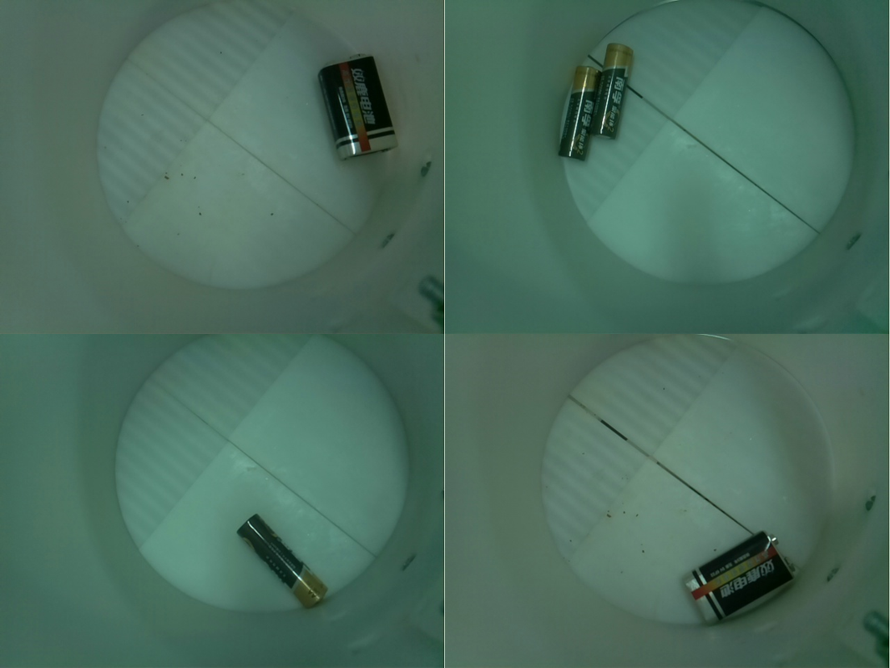
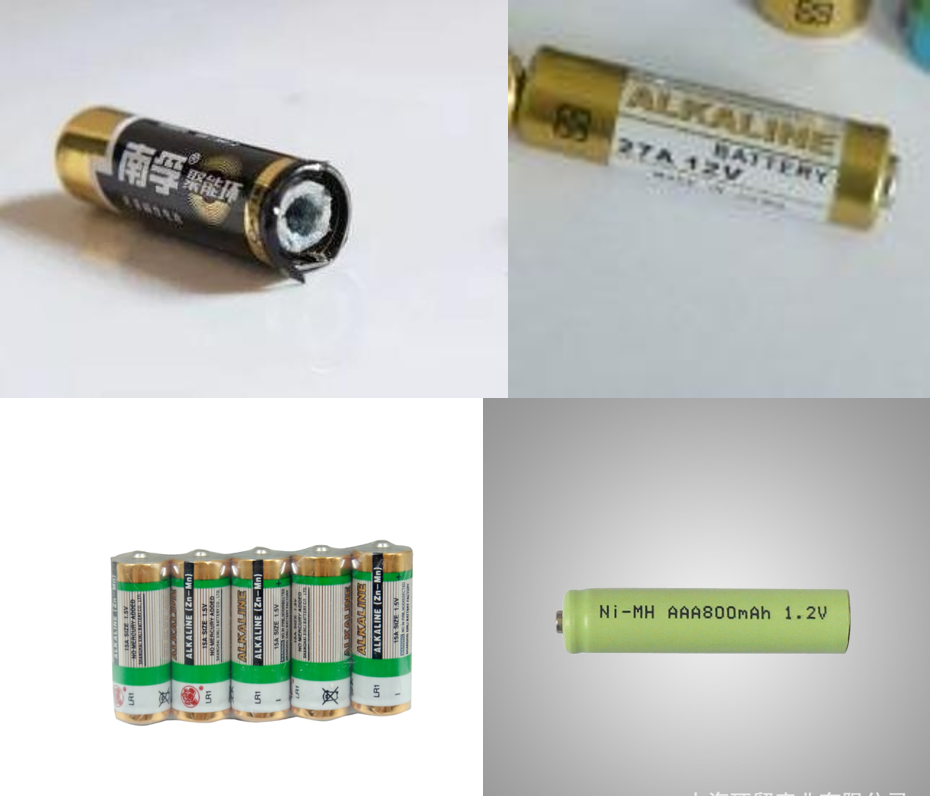
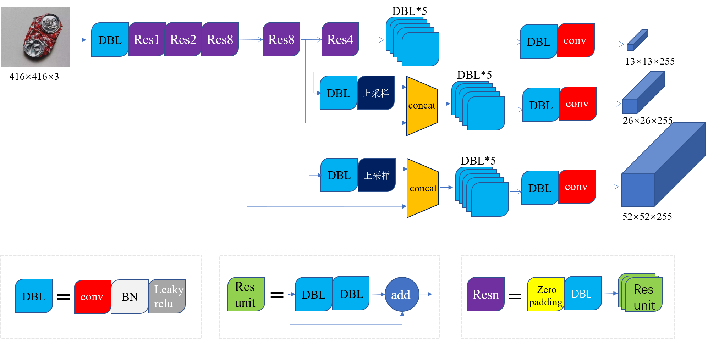
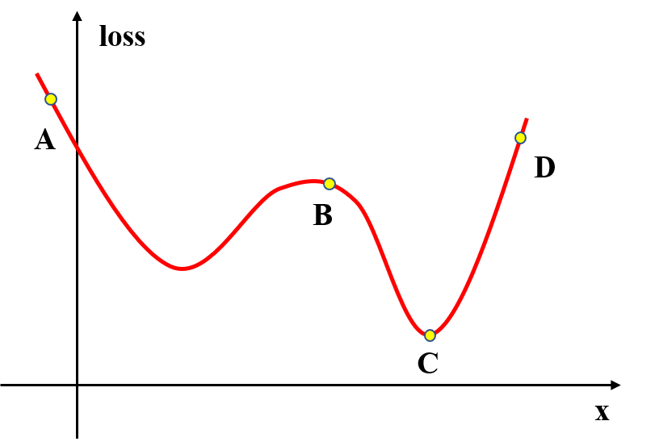
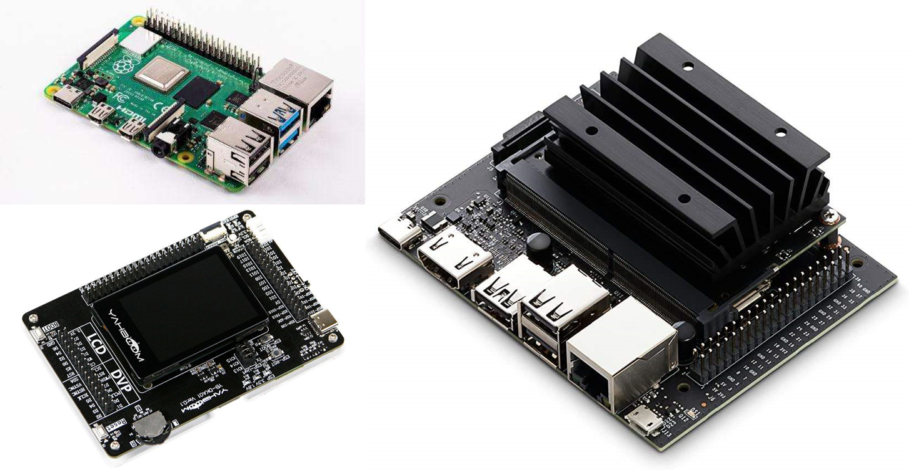

## 深度学习的基础实现流程

### 数据集准备

深度学习需要**大量数据的支撑**，搭建好的模型，通过大量的数据学习之后，才会拥有**强大的泛化能力**。模型对数据集的所有图片不停地学习，收敛到一定程度之后，输入一张**全新的图片**（不在数据集内），也会输出一个**相对正确的结果**。数据集包含的**场景越多**，**背景越复杂**，最终实现的效果会越好。数据集应该包含项目可能出现的所有情况，如**光照**、**贴纸**等不利干扰情况，都需要在数据集中出现。

但是对于我们单个具体项目而言，**拍摄多个场景的物体是比较困难**的，自己架设好摄像头，拍摄出来的背景也是**比较单一**的，难以**满足丰富、复杂、随机的**要求。

如上图自己制作的有害垃圾数据集，因为假设好了机械结构，背景非常单一。电池的种类也非常有限，无法将所有种类的电池都采购到。**拍摄过多类似的图片，不仅无法满足数据集的要求，而且最终的模型精度也会受到较大影响**。所以建议添加一些**网上的现有数据集，或者通过爬虫等方式**，来**扩充数据集的复杂和随机程度**，自己拍摄也可以故意制造一些特有场景。

以目标检测为例，理想情况下，包含单个物体的图片数要**大于1500张**，单个物体的出现次数要**大于10000个**，并且都需要进行**标注**。数据集的制作是**非常耗时**的，尤其在标注时，需要消耗大量的精力。

### 数据增强

除了尽可能增加图片的个数和复杂度意外，数据增强是最为常用的**扩充数据集**方法，也对模型精度的提升有极大的帮助。可以说数据增强是一个非常有实用的技巧。

可以看到，相比于原图，可以**随机地改变对比度、亮度，或是扣去一些像素点**，甚至是**多张图片的重叠、拼接**，这些都是数据增强的手段，数据增强可以提高难度，也可以成倍地扩充数据集，这对于**大多数场景来说都是非常有效的**，特别是对于数据集不充足的情况下，使用数据增强可以**极大地提高精度和泛化能力**。然后，需要注意的是，对于**绝大多数轻量化的小模型，应该尽量减少数据增强**，因为小模型的拟合能力有限，过度增加图片复杂程度，不利于最终的收敛过程。

### 模型的搭建

深度学习的模型是最为关键的一个环节，对于计算机视觉来说，模型一般都是由**卷积结构组成的卷积神经网络**。

上图是**YOLOv3的整体模型结构**，YOLOv3是目标检测的一个经典算法。可以看到整个模型都是由卷积结构组成，对于原始（416，416，3）的原始图像，输入模型之后，输出了三个结果，对这三个结果进行筛选后就可以得到预测框的位置，最终实现以下的效果。

模型内**待求的参数一般都比较多**，不同于我们基础学科，用一些多项式拟合的方法，计算机视觉模型的参数是非常多的，这也就意味着它的**拟合能力非常强**，模型也是非常庞大的，对于一般的图像任务都能够找到**相应的拟合结果**，也拥有**很强的泛化能力**。

### 模型的训练

显然，原始的模型参数是**无法一下子获得我们想要的结果的**，针对我们特性化的项目要求，比如我要检测易拉罐，我们检测行人等等，需要**训练我们的模型**，让模型知道我们到底要识别什么东西。换句话来说，就是将我们刚刚准备好的数据集，不停地导入到我们的模型里，我们的模型会输出一个**结果（pred)**，也就是**预测值**，将这个预测值和我们标注的**真值（target）求偏差（loss）**，利用数学的方法降低这个偏差，那么就意味着预测值会越来越接近真值，也就是模型输出的结果越来越符合我的要求。

举个简单的例子，例如**输入为x，真值为y，模型为F（X）**,预测值pred为：
$$
pred = F(x)
$$
再用最简单公式求出误差:
$$
loss =\frac{1}{2}\times(pred - y)^2 = \frac{1}{2}\times(F(x)-y)^2
$$
可以看出loss是和模型所有参数都有关的一个函数，假设**loss的曲线**如下：

我们的目标是让**误差loss尽可能低**，也就是**接近C点附近**，对于A、B、D的情况，我们都希望**修正模型参数x来降低loss**，这就是**优化器**的工作。如果使用**梯度下降法（GD）**，它是这样修正的:
$$
{x_i} = {x_i} - \alpha  \times {\partial  \over {\partial {x_i}}}\left( {F\left( x \right)} \right)
$$
其中的**a为步长，也称为学习率**，梯度下降法可以使得其他点向C点收敛，但主要存在两个问题。

1. 需要求解所有参数的梯度，计算量非常庞大
2. 容易陷入到局部最优解中，如图中的第一个极小值

目前我们常用的优化器有**SGD、Adam**等。**SGD**也就是**随机梯度下降法**，但是虽然包含一定的随机性，从期望上来看，它是等于正确的导数的，每次都只需要对一部分参数求梯度，**大大减少了计算量**。同时由于随机性，可以**有效地躲开局部最优解**，也就是鞍点。解决了GD的两大问题，在计算机视觉领域受到了广泛的使用。

### 模型的部署和预测

对于绝大多数项目，一般都需要将模型部署到具体的硬件中，比如说**ARM开发板**、**FPGA**等，**部署也是非常重要的一个板块**。

我们的终端设备**几乎不可能配一个台式主机**，也就意味着没有很强大的计算能力和存储能力。部署的关键在于保证精度的情况下，**尽可能压缩模型体积，提升模型预测速度**。可以使用现在一些开源的工具，如**ncnn**、**tensorrt**、**paddle-lite**等进行相应的部署。

