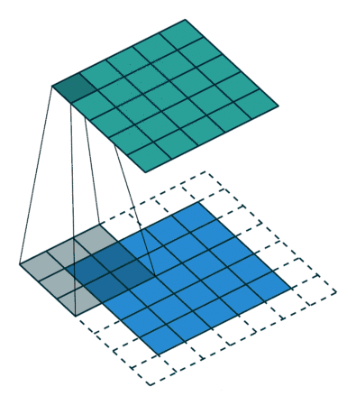
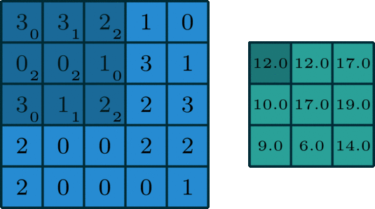
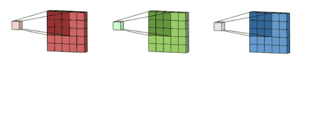
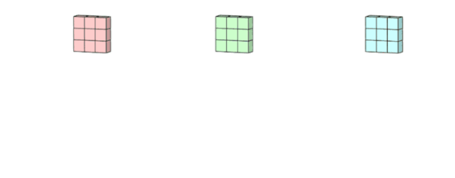
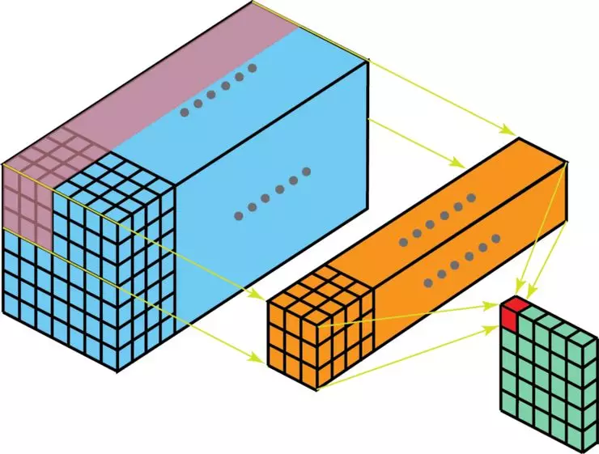
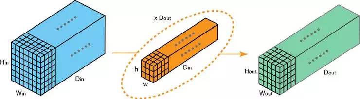
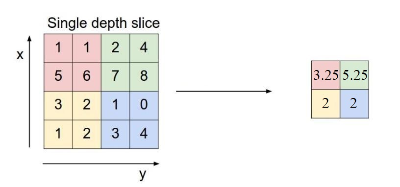
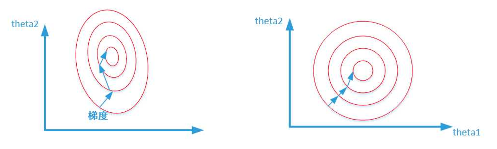
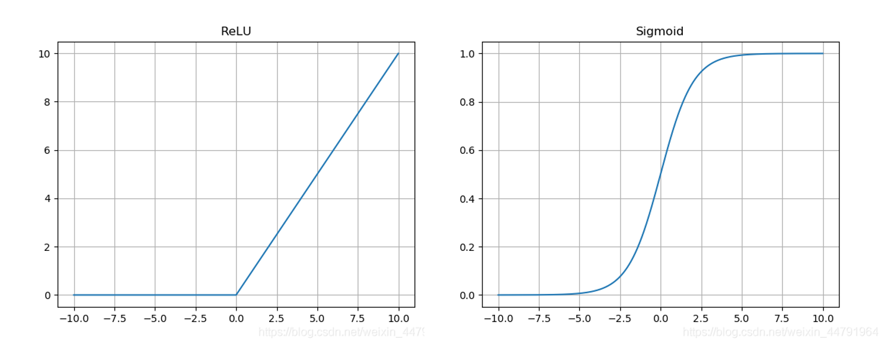

## 卷积(Convolution)

卷积是卷积神经网络中最常用的操作，卷积到底是如何运算的呢？

我们先从**一维**来看，如上图所示，有一个**滑动的窗口**从左到右，从上到下滑动，这个滑动的3*3的矩阵我们就称作**卷积核**，卷积核里面的数和输入矩阵的数字**一一相乘后相加**，就得到了一个新的数字，这些新的数字按从左到右、从上到下的顺序排列，就得到了输出矩阵，整个这个过程，我们就叫做**卷积**。

通过一维的卷积我们可以看到，**输入的矩阵内的数字是固定的**，输出矩阵的数字其实完全取决于**卷积核内的数字**，如果我想要输出正确的结果，只能通过**修正卷积核**。换句话来说，**卷积核就是我们需要修正的参数**，这一点希望大家能够明确。

对于图像来讲，我们看到的都是**三通道的彩色图**（RGB格式），也就是说**最初的输入是一个3通道的矩阵**，比如（3，640，640），对于多通道的矩阵，卷积操作也不难理解。

其实就是将**一维的卷积重复了三次**，**有3个卷积窗口分别滑动得到了三个矩阵，最后将这三个矩阵内的数相加**，得到了最后的输出。可以看到上图的输入shape为（3，5，5），卷积核的shape为（3，3，3），输出的shape为（1，3，3）

然而，输入图像往往需要经过多个卷积层才能输出，也就是说，**输入的通道数是不固定的，可能是3、16、64等等**，对于这些情况如何卷积呢？

如上图所示，有一个通道数很大的输入矩阵，类比我们三通道的卷积方式，其实也不难看出，**卷积核的通道数应该等于输入的通道数**，这样每一层对应起来，其实就变成了一维的形式，最后把每层的结果相加，就得到了一个**一维的输出矩阵**。

到这边其实还没有结束，因为除了输入通道以外，我们还希望可以**控制输出通道数**。具体如何控制输出通道数呢？

就是用**Dout个卷积核**重复我们上一步的操作，这样的话，**输入通道和输出通道都可以是任意的数**。

我们可以作出以下的总结，对于一个（Din,Hin,Win）的输入矩阵，经过Dout个（Din,h,w）的卷积核之后，输出为（Dout,Hout,Wout）的矩阵。换句话来说**卷积核的通道数等于输入通道数，卷积核的个数等于输出通道数。**

## 池化(Pooling)

除了卷积以外，池化也是一个比较常用的运算操作，池化主要分为两种**最大池化和平均池化。**

上图分别为最大池化和平均池化，池化窗口的大小为（2，2）,步长为2，**池化就是将这个窗口内的数变成一位数**，对于最大池化来说，就是变成**窗口内的最大数**，平均池化就是变成**窗口内所有数的平均值**。对于多通道的输入来说，池化和卷积不同，池化就是对每一个通道上都进行这样的操作，最后不需要加在一起，也就是说**池化前后的输入输出通道不变**，仅仅改变了特征图的大小。

更加直观得来说，池化其实相当于对特征图进行了resize的操作。图像的**特征特征不会明显改变，池化可以有效地减少参数量，而且可以有效地防止过拟合。**

## 归一化(Normalization)

归一化的含义也非常简单，**就是把矩阵内所有的数不失真地映射到0-1之间**。这样做可以**防止某一维或某几维对数据影响过大**，一般我们在卷积运算之后紧跟着都需要进行归一化操作。

左图是未归一化的梯度等高图，右图是归一化之后的图，明显**左图受到某些维度的数据影响过大**，右图梯度下降就**平缓很多**，相对更容易达到**期望的最优解**。

## 激活函数(Activation)

通过以上的讨论，不难发现整个卷积网络都是对矩阵的一些**线性化操作**，对于一些非线性的情况，是**无法精确拟合的**，这就需要增加一些函数略微扭曲输出的结果，**这些函数也被称为激活函数**。

常见的激活函数有很多，例如**relu,swish,mish,softmax**等。

这些激活函数看似**区别不大**，对最终的模型表现却有**极大的影响**。例如有些激活函数是**无上下限的**，有些函数**时间成本很高**，这些都会影响到最后**模型的速度和精度**。

## 参考资料

https://mp.weixin.qq.com/s?__biz=MzA5ODEzMjIyMA==&mid=2247496109&idx=1&sn=a7a6558b086266c062925600e3e71394&source=41#wechat_redirect

https://blog.csdn.net/gwplovekimi/article/details/89890510

https://blog.csdn.net/program_developer/article/details/78637711?utm_medium=distribute.pc_relevant.none-task-blog-2~default~baidujs_baidulandingword~default-4.pc_relevant_aa&spm=1001.2101.3001.4242.3&utm_relevant_index=7
