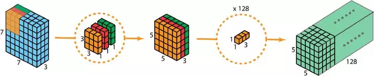
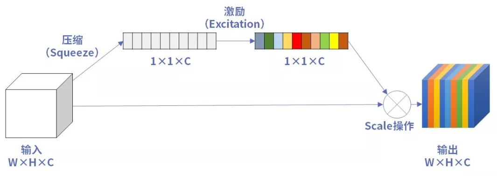
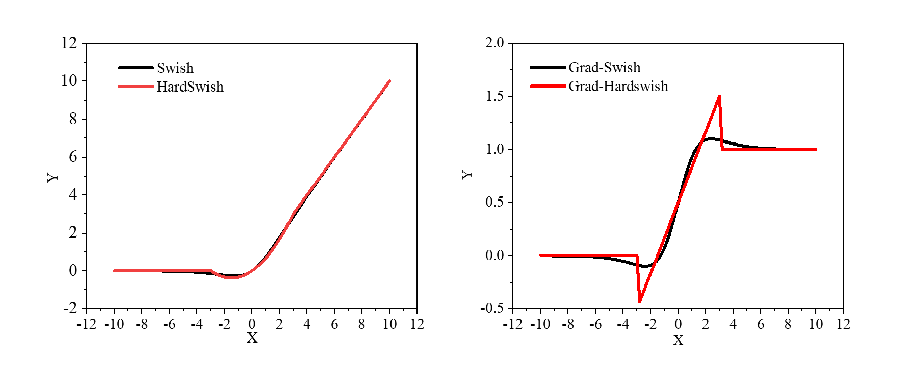
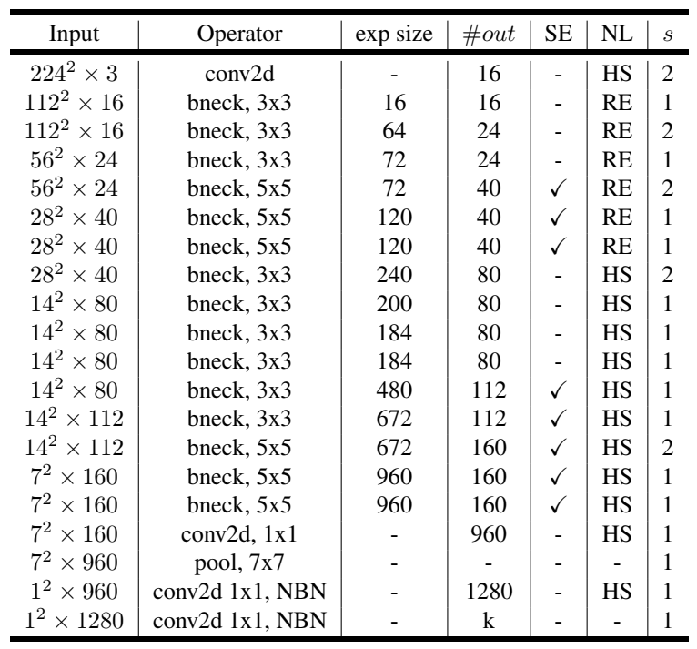

## 介绍

**Mobilenet**是由**Google**公司创造的网络系列，目前已经发布至**V3**版本，每一次版本更新都是**在前一次网络上的优化修改**。**Mobilenet**主打的是**轻量级网络**，也就说网络参数量较少，执行速度较快，也**更容易部署到终端设备上**。在移动端和嵌入式设备上也有了很多的应用。

**MobilenetV3**对**MobilenetV2**进行了一系列小的修改，实现了**精度的再次突破，速度也有所提升。**

## 主要结构

### 深度可分离卷积

<div align="center">

</div>


**MobilenetV3**的主体部分大量使用了**深度可分离卷积**，在上一讲中我们做了详细的介绍。再次指出，这种卷积结构**极大地减少了参数量**，对于轻量级的网络是非常有利的。

### SE注意力机制

<div align="center">

</div>

在**MobilenetV3**的基础结构中，使用了**SE注意力机制**，这一点我们上一讲也做了介绍。因为**SE注意力机制会增加少量的参数**，但对于精度有提升，所有**MobilenetV3中对某些层加入了SE注意力机制，追求精度和参数量的平衡**。而且对初始的注意力机制做了一定的修改，主要体现在**卷积层**和**激活函数**。

### 新型的激活函数

**MobilenetV3**中使用了**Hardswish**激活函数，代替了**Swish**激活。


$$\begin{split}Hardswish(x)= \left\{ \begin{aligned} &0, & & \text{if } x \leq -3 \\ &x, & & \text{if } x \geq 3 \\ &\frac{x(x+3)}{6}, & & \text{otherwise} \end{aligned} \right.\end{split}$$

$$Swish(x) = \frac{x}{1 + e^{-x}}$$

从公式上来看，**Hardswish**代替了指数函数，从而**降低了计算的成本**，使模型轻量化。

<div align="center">

</div>

做出**函数图像和梯度图像**，可以看出**原函数非常接近**。在梯度图上**Hardswish**存在**突变**，这对于训练是**不利**的，而**swish**梯度变化**平滑**。也就是说**Hardswish加快了运算速度**，但是**不利于提高精度**。**MobilenetV3**经过多次实验，发现**Hardswish**在**更深的网络**中精度损失较小，最终选用在网络的**前半部分**使用了**Relu**激活，在**深层网络**中使用了**Hardswish**激活。

### 修改了尾部结构

**MobilenetV3**修改了**MobilenetV2**的尾部结构，具体修改如下：

<div align="center">

</div>


**MobilenetV2**最后的尾部使用了**四层卷积层再接了一个平均池化**，**MobilenetV3**仅通过**一个卷积层**修改通道数后，直接接了**平均池化层**。这也**大大减少了网络的参数**量，在实验中发现，**精度并没有降低**。

## 整体网络

经过以上的一些小的修改后，**MobilenetV3**的**整体网络**形式就非常清晰了，它的**通用结构单元**如下：

<div align="center">

</div>

整体网络就是由**多个这样的单元堆叠**而成。**MobilenetV3**有**large**和**small**两个版本，我们以**large**为例分析。

<div align="center">

</div>

表中**input**表示输出的**shape**，**exp size**表示扩大的**通道数**，**out**表示**输出通道数**，**SE**表示**是否使用SE注意力机制**，**NL**表示使用的**激活函数**，**S**表示卷积的**步长**。

**bneck**就是第一个图所示的格式，可以看到中间**重复使用了多次**。先使用一个卷积层，把通道数扩充到**16**，之后通过多个**bneck**充分提取特征，然后接着使用一个**尾部结构**，最后输出一个**类别数的矩阵**。因为目前写论文通常使用的是**imagenet**数据集，是一个**1000类别**的庞大分类数据集，所以官方网络一般最后输出的维度都是**1000**。

## 使用PaddleClas训练MobilenetV3

**PaddleClas**是依赖于**paddle**的视觉分类套件，其中集成了很多**分类**的典型网络，我们使用**PaddleClas**中的**MobilenetV3**训练一下**垃圾分类任务**。

**PaddleClas**中**MobileNetV3**整体的代码实现如下：

```
class MobileNetV3(TheseusLayer):
    """
    MobileNetV3
    Args:
        config: list. MobileNetV3 depthwise blocks config.
        scale: float=1.0. The coefficient that controls the size of network parameters. 
        class_num: int=1000. The number of classes.
        inplanes: int=16. The output channel number of first convolution layer.
        class_squeeze: int=960. The output channel number of penultimate convolution layer. 
        class_expand: int=1280. The output channel number of last convolution layer. 
        dropout_prob: float=0.2.  Probability of setting units to zero.
    Returns:
        model: nn.Layer. Specific MobileNetV3 model depends on args.
    """

    def __init__(self,
                 config,
                 scale=1.0,
                 class_num=1000,
                 inplanes=STEM_CONV_NUMBER,
                 class_squeeze=LAST_SECOND_CONV_LARGE,
                 class_expand=LAST_CONV,
                 dropout_prob=0.2,
                 return_patterns=None):
        super().__init__()

        self.cfg = config
        self.scale = scale
        self.inplanes = inplanes
        self.class_squeeze = class_squeeze
        self.class_expand = class_expand
        self.class_num = class_num

        self.conv = ConvBNLayer(
            in_c=3,
            out_c=_make_divisible(self.inplanes * self.scale),
            filter_size=3,
            stride=2,
            padding=1,
            num_groups=1,
            if_act=True,
            act="hardswish")

        self.blocks = nn.Sequential(* [
            ResidualUnit(
                in_c=_make_divisible(self.inplanes * self.scale if i == 0 else
                                     self.cfg[i - 1][2] * self.scale),
                mid_c=_make_divisible(self.scale * exp),
                out_c=_make_divisible(self.scale * c),
                filter_size=k,
                stride=s,
                use_se=se,
                act=act) for i, (k, exp, c, se, act, s) in enumerate(self.cfg)
        ])

        self.last_second_conv = ConvBNLayer(
            in_c=_make_divisible(self.cfg[-1][2] * self.scale),
            out_c=_make_divisible(self.scale * self.class_squeeze),
            filter_size=1,
            stride=1,
            padding=0,
            num_groups=1,
            if_act=True,
            act="hardswish")

        self.avg_pool = AdaptiveAvgPool2D(1)

        self.last_conv = Conv2D(
            in_channels=_make_divisible(self.scale * self.class_squeeze),
            out_channels=self.class_expand,
            kernel_size=1,
            stride=1,
            padding=0,
            bias_attr=False)

        self.hardswish = nn.Hardswish()
        self.dropout = Dropout(p=dropout_prob, mode="downscale_in_infer")
        self.flatten = nn.Flatten(start_axis=1, stop_axis=-1)

        self.fc = Linear(self.class_expand, class_num)
        if return_patterns is not None:
            self.update_res(return_patterns)
            self.register_forward_post_hook(self._return_dict_hook)

    def forward(self, x):
        x = self.conv(x)
        x = self.blocks(x)
        x = self.last_second_conv(x)
        x = self.avg_pool(x)
        x = self.last_conv(x)
        x = self.hardswish(x)
        x = self.dropout(x)
        x = self.flatten(x)
        x = self.fc(x)

        return x
```

具体训练也很简单，我们只**需要修改相应的配置文件**，存放在**ppcls/config目录下**。对于训练自己的数据集，**着重需要修改数据集的相关参数，batch_size以及输出图像的大小等**，其他根据自己的需求进行修改。

训练的方法是使用命令行命令。

**训练命令**：

```
python tools/train.py -c ./ppcls/configs/quick_start/MobileNetV3_large_x1_0.yaml -o Arch.pretrained=True   -o Global.device=gpu
```

**断点训练命令**：

```
python tools/train.py -c ./ppcls/configs/quick_start/MobileNetV3_large_x1_0.yaml -o Global.checkpoints="./output/MobileNetV3_large_x1_0/epoch_5" -o Global.device=gpu
```

**预测命令**：

```
python tools/infer.py -c ./ppcls/configs/quick_start/MobileNetV3_large_x1_0.yaml -o Infer.infer_imgs=./188.jpg -o Global.pretrained_model=./output/MobileNetV3_large_x1_0/best_model
```

## 参考资料

https://arxiv.org/abs/1905.02244

https://github.com/PaddlePaddle/PaddleClas

https://blog.csdn.net/qq_42617455/article/details/108165206
